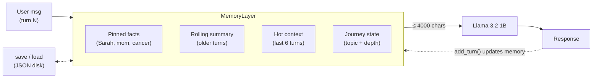

# Khamuel MemoryLayer — POC Implementation

> On-device conversational memory for a **1-billion-parameter** Christian chatbot.
> This repo is the submitted implementation of the WizePeeps Khamuel paid POC
> (original brief further below).

**The hard problem.** Llama 3.2 1B has an ~8K context, drifts on long threads, and
loses early facts — by turn 13 it no longer remembers the user's late mother
*Sarah*. **The fix.** A `MemoryLayer` that re-injects a compact, self-updating
snapshot of the conversation into the model on **every turn**, taking fact recall
from **0/8 → 6/8** while holding the LLM-judge at **4–5/5** and passing the
cross-session test — all on a 1B running locally via Ollama.

## Architecture

*Self-updating context, injected every turn.*



Every turn, `MemoryLayer` assembles a `< 4000`-char context from four blocks and
injects it (system block + native chat history) into the 1B:

| Block | Role |
|---|---|
| **Pinned facts** | Core anchors (mother *Sarah*, cancer, the user's role) extracted once from the early turns and injected on *every* turn forever — the fix for fact recall |
| **Rolling summary** | Turns older than the hot window, compressed every 6 turns (Ollama @ temperature 0.2, with a safe template fallback) |
| **Hot context** | Last 6 turns, delivered as native chat messages |
| **Journey state** | Monotonic `{topic, depth 0–4}` line that stops the bot resetting to basics |

**Guardrails.** Self-evolving via `add_turn()` · maintains the context-window size ·
de-dupe · structured summary with a pre-defined template fallback · JSON save/load
(no database) · **graceful budget degradation** — when near 4000 chars, drop the
oldest hot turns before ever touching the pinned facts or summary.

**Results** (single `python -m stubs.runner --eval --all`):
`fact recall 6/8 · repetition 0.00 · restart-markers 0 · topic-adherence 4/5 ·
progressive-depth 4/5 · cross-session continuity 5/5` — all gated thresholds cleared.
See [`WRITEUP.md`](WRITEUP.md) for the approach and the one hard tradeoff, and
[`REPRODUCE.md`](REPRODUCE.md) to run it yourself.

---

<sub>↓ Original POC brief (the task as given) ↓</sub>

# WizePeeps Khamuel — Paid POC Kit

A paid proof-of-concept for the on-device Christian chatbot inside the WizePeeps Flutter app. This kit lets you implement and demonstrate the **single hardest unproven problem** in the project — long-thread conversational continuity on a 1B-parameter model — entirely on your Mac via Ollama, without needing the production app or device access.

**Time:** ~15 hours of dev work over 3–5 days.
**Tooling:** Mac + Python 3.10+ + Ollama. No iOS or Android device needed for this POC.

---

## What you're testing (the hard problem)

A 1B model has 8K context, drifts on long threads, loses early facts, and resets to basics around turn 12 no matter what the system prompt says. **Five candidates have proposed five different architectures for this problem; none has shipped it on a 1B model in production.** This POC asks you to prove yours actually works.

You implement a `MemoryLayer` that lets `llama3.2:1b-instruct-q4_K_M` sustain a coherent, non-repetitive, fact-tracking 20-turn conversation about a single grief topic — without restart-at-basics on turn 17.

---

## Setup (~10 minutes)

```bash
# 1. Install Ollama
curl -fsSL https://ollama.com/install.sh | sh
# (or: `brew install --cask ollama` for the menu-bar app on macOS)

# 1a. Start the daemon if not already running
# - macOS .app install: launch Ollama once from /Applications/Ollama.app; menu bar icon = daemon up
# - Homebrew formula or curl install: run `ollama serve` in a separate terminal
# Verify the daemon is reachable:
curl -s http://localhost:11434/api/tags
# Should return JSON ({"models":[]} on a fresh install is fine)

# 2. Pull the model
ollama pull llama3.2:1b-instruct-q4_K_M

# 3. (Optional but recommended) Pull the judge model for local rubric scoring
ollama pull llama3.2:3b

# 4. Clone this kit
git clone <repo-url> khamuel-poc-kit
cd khamuel-poc-kit

# 5. Set up Python environment
python3 -m venv .venv
source .venv/bin/activate
pip install -r requirements.txt

# 6. Run the baseline (no memory layer — pure Ollama responses)
python -m stubs.runner --baseline --script prompts/grief_20turn.json
# Measured baseline on Apple M-series (no memory layer):
#   - LLM-judge topic adherence / progressive depth: ~4/5 each (the 1B model is broadly coherent)
#   - Fact recall: 0 of 8 late turns mention Sarah or "my mother" — THIS is the gap your layer fixes
#   - Repetition: ~0.05 near-dup pairs per response (low — model writes long varied responses)
#   - Restart marker reuse: 0
# Your job: hold the LLM-judge scores at >=4 AND push fact recall to >=3 of 8.

# 7. Run the deterministic scorer on the baseline
python -m eval.score_long_thread eval_results/grief_20turn_baseline.json
```

If all six steps above complete on your Mac, you're ready to implement.

### Sample deliverable files

The `samples/` directory shows the exact shape your final submission should match:

| Sample file | What it is |
|---|---|
| `samples/sample_grief_20turn.json` | A real baseline transcript — confirms the JSON schema your `eval_results/grief_20turn.json` must match |
| `samples/sample_grief_20turn_scores.json` | The deterministic scorer's output format, showing the bar to beat (`all_deterministic_pass: false` on baseline) |
| `samples/sample_grief_20turn_judge.json` | The LLM-judge output format, showing the baseline's 4/5 rubric scores you must hold while raising fact recall |
| `samples/WRITEUP_example.md` | Template for the 1-page `WRITEUP.md` you submit |

See `samples/README.md` for what each file demonstrates.

---

## What you implement

**One file: `stubs/memory.py`** — see the docstring in that file for the full signature.

Your `MemoryLayer` must include:

| Layer | Behaviour |
|---|---|
| **Hot context** | Last 6 turns verbatim, passed to the model on every call |
| **Rolling summary** | Every 6 turns, generate a ~200-token structured summary of older turns using Ollama itself (constrained prompt, temperature 0.2). Replace older raw turns with the summary. Summary-of-summary fold at 24+ turns, bounded ~400 tokens. |
| **Key facts** | Extract named entities (people, life events, recurring situations) on each user turn. Store and surface the top-5 most relevant on every turn under `Things Khamuel knows about you:` header. |
| **Topic-pin / journey state** | Maintain `{topic, depth_level, last_milestone}` per thread. `depth_level` (0–4) advances based on turn count + concept density. Use it to prevent re-explaining basics after turn 10. |
| **Cross-session persistence** | `.save(path)` / `.load(path)` to serialize state to disk for the cross-session test |

Total context built per turn must be ≤ 4000 chars. Truncate older content first when over budget.

**You may modify `stubs/runner.py`** if needed to wire your memory layer correctly, but keep the CLI flags working.

**Do NOT implement:** verifier, RAG retrieval, qualifier extraction, LoRA, web search, apologetics, crisis detection. Those are post-POC.

---

## The 3 tests your implementation must pass

All tests run via the included scripts. Outputs land in `eval_results/`.

### Test 1 — Long-thread coherence

```bash
python -m stubs.runner --eval --script prompts/grief_20turn.json
python -m eval.score_long_thread eval_results/grief_20turn.json
python -m eval.llm_judge eval_results/grief_20turn.json
```

**Pass criteria (ALL four must hit):**

| Metric | How measured | Target |
|---|---|---|
| Topic adherence | LLM-as-judge 1–5 | **≥ 4.0** |
| Fact recall | Automated: turns 13+ mention "Sarah" or "my mother" | **≥ 3 of the 8 late turns** |
| No basics-restart | Automated: late turns must NOT reuse restart markers from early turns | **0 reused markers** |
| Repetition | Automated: avg near-duplicate sentence pairs (cosine > 0.85) per response | **≤ 0.5** per response |

### Test 2 — Cross-session persistence

```bash
python -m stubs.runner --eval --script prompts/grief_20turn.json --turns 1-10
# (your MemoryLayer.save() is called automatically after turn 10)

python -m stubs.runner --eval --resume --script prompts/grief_20turn.json --turns 11-20
# (your MemoryLayer.load() is called before turn 11)

python -m eval.score_long_thread eval_results/grief_20turn_11-20.json
python -m eval.llm_judge eval_results/grief_20turn_11-20.json
```

**Pass criteria:**

| Metric | Target |
|---|---|
| Memory state successfully reloads from disk | true |
| Turn 11 response references at least 1 fact from turns 1–10 | true |
| LLM-judge continuity (cross_session_continuity dimension) | **≥ 4.0** |

### Test 3 — Reproducibility

Moses clones your delivered kit on a fresh Mac, follows your `REPRODUCE.md`, runs:

```bash
python -m stubs.runner --eval --all
python -m eval.score_long_thread eval_results/grief_20turn.json
python -m eval.llm_judge eval_results/grief_20turn.json
```

**Pass criteria:**

| Metric | Target |
|---|---|
| Time from fresh Mac to first eval output | **< 30 min** |
| Scores match your reported `eval_results/` within 5% | true |
| Single command runs the full eval | true |

**Non-negotiable.** A working implementation that can't be reproduced is a failed POC.

---

## Deliverable structure

End of POC, deliver a zip or git repo:

```
khamuel-poc-<your-name>/
├── stubs/                           ← your modified memory.py (+ runner.py if needed)
├── eval_results/
│   ├── grief_20turn.json            ← full 20-turn transcript
│   ├── grief_20turn_scores.json     ← deterministic metrics
│   ├── grief_20turn_judge.json      ← LLM-as-judge scores
│   ├── grief_20turn_1-10.json       ← cross-session part 1
│   └── grief_20turn_11-20.json      ← cross-session part 2
├── REPRODUCE.md                     ← your fully filled-in reproduction guide
└── WRITEUP.md                       ← 1 page: approach, what worked, what didn't, one design tradeoff
```

---

## Hard rules

1. **No payment if the eval scripts don't run end-to-end on a fresh Mac following your `REPRODUCE.md`.**
2. **No payment for notebooks, slide decks, or design documents instead of working Python code.**
3. **Daily 15-min sync optional** — skip OK, but 48+ hours of silence = grounds for early termination.
4. **All work in this POC is yours intellectually** — Moses commits to using it only with you, or paying a buyout fee if engaging another candidate.

---

## Why we're testing this specifically

The verifier, RAG, qualifier handling, web search, and apologetics are all real Phase 1–3 work — but they're implementation exercises with well-understood architectures. The single hardest unproven question on this project is whether a 1B model can hold coherent conversation across 20+ turns on a single topic without your memory architecture either over-summarizing (loses key facts) or under-summarizing (blows the context window). Five candidates proposed five different designs. Only the POC tells us which one actually works.

If you ship a memory layer that passes these tests in 3–5 days, the rest of the project is downhill from here.
